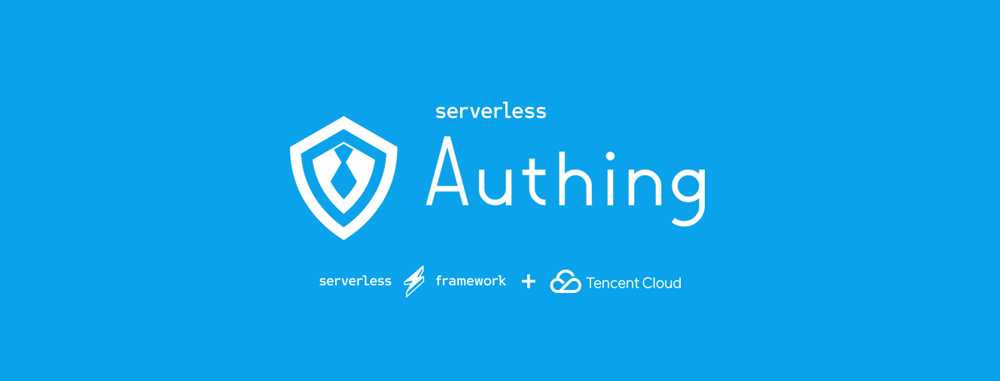
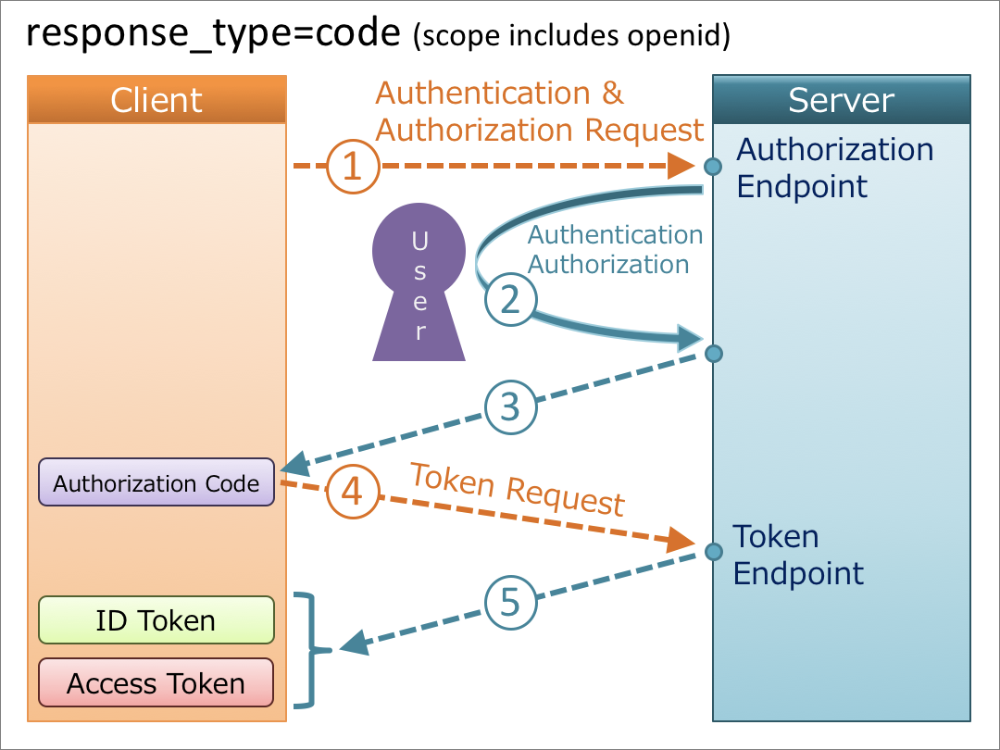
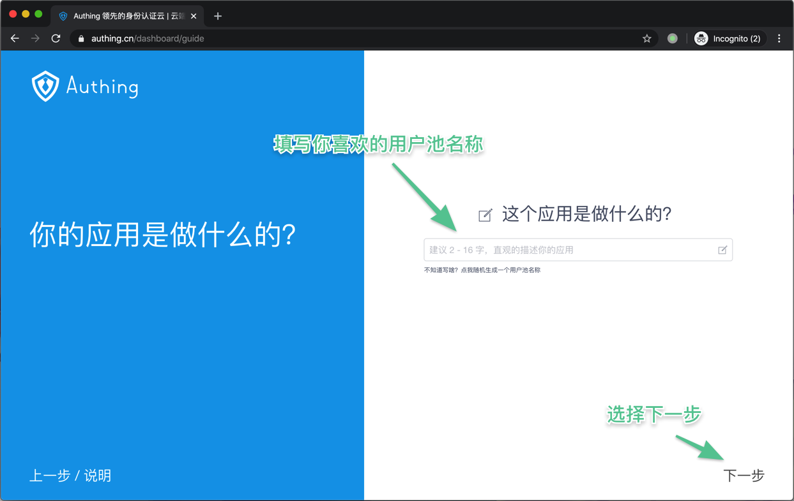
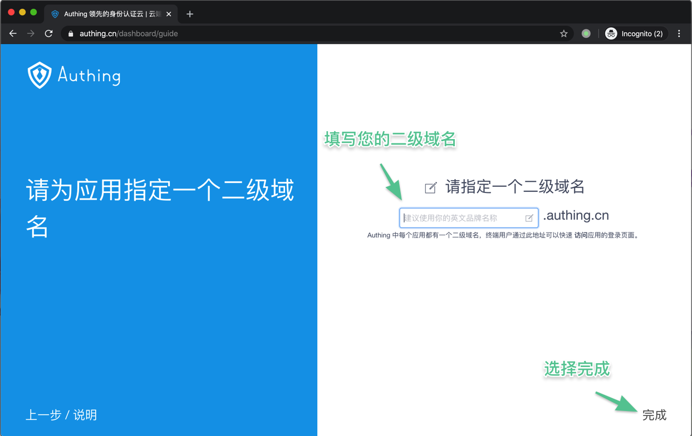
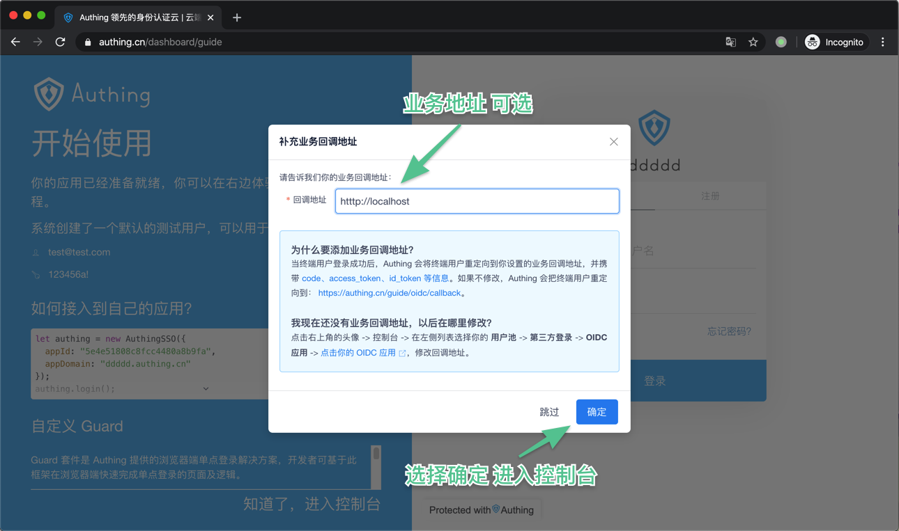
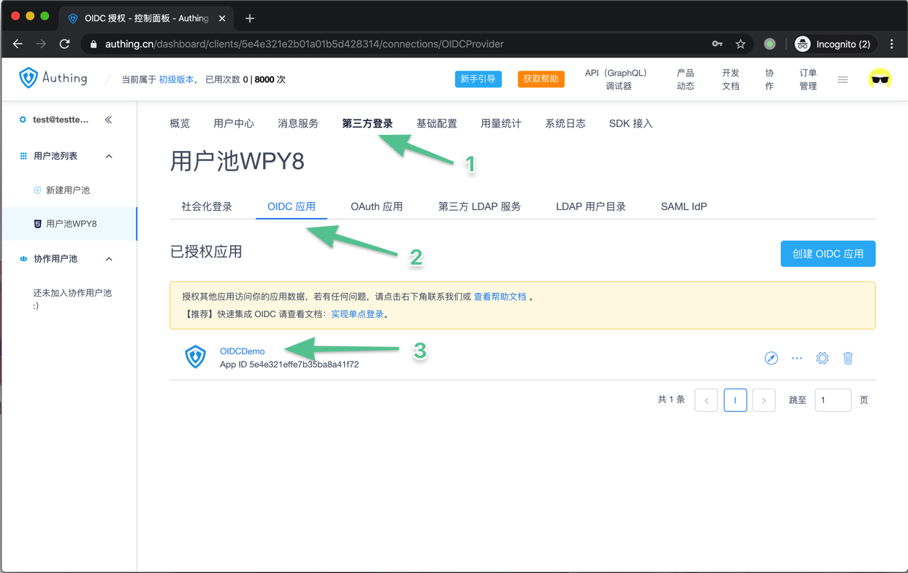
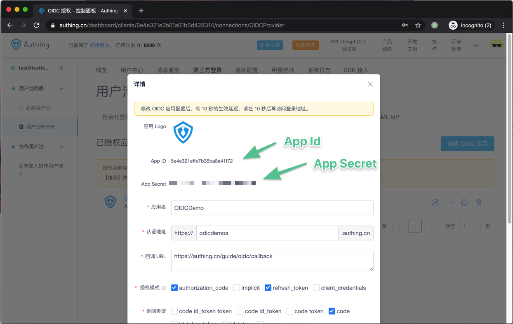

# Serverless-OIDC



Serverless Authing OIDC(OpenID Connect) Demo.

<p align="center">
  <span>简体中文</span> |
  <a href="./README_en.md">English</a>
</p>

## 什么是 OIDC 协议

> OpenID Connect 1.0 is a simple identity layer on top of the OAuth 2.0 protocol. It allows Clients to verify the identity of the End-User based on the authentication performed by an Authorization Server, as well as to obtain basic profile information about the End-User in an interoperable and REST-like manner.

**OpenID Connect 简称 OIDC，是 OAuth 2.0 的一个扩展，主要增加了语义化的用户信息字段。**

下图是一个以授权码为例子的 OIDC 授权流程

更多信息可以查看 [OIDC 流程](https://docs.authing.cn/authing/advanced/oidc/understand-oidc)

## 应用介绍 🏠

您可以通过以下几步操作快速的创造一个由 Authing 提供的使用标准 OIDC 协议运行的 serverless 应用。

## 示例链接 🔗

[Serless Oidc Demo](http://service-jaom3m0x-1257685189.sh.apigw.tencentcs.com/)

## 前提条件 🧾

在使用之前，请确保具备以下条件：

1.  [Node.js](https://serverlesscloud.cn/doc/providers/tencent/cli-reference/quick-start#node) （8.x 或以上的版本）
2.  Serverless Framework CLI
3.  Authing OIDC AppID && Secert

### 安装 Node.js 和 NPM

- 参考 [Node.js 安装指南](https://nodejs.org/zh-cn/download/) 根据您的系统环境进行安装。
- 安装完毕后，通过 node -v 命令，查看安装好的 Node.js 版本信息：

```shell
$ node -v
vx.x.x
```

- 通过 npm -v 命令，查看安装好的 npm 版本信息：

```shell
$ npm -v
x.x.x
```

### 安装 Serverless Framework CLI

- 在命令行中运行如下命令：

```shell
$ npm install -g serverless
```

- 安装完毕后，通过运行 serverless -v 命令，查看 Serverless Framework CLI 的版本信息。

```shell
$ serverless -v
x.x.x
```

### 注册 Authing 账户

1. 首先访问[Authing SSO](https://sign.authing.cn/login)进行注册，在注册成功后会自动跳转至 Guide 页面指引你创建一个用户池。
   
2. 在这里填写想要的用户池名。
   
3. 选择二级域名 你可以选择一个你喜欢的二级域名作为你的业务域名。

     

4. 填写回调地址 在这里可以选择你喜欢的业务回调地址。

     

5. 选择 OIDC 应用  
   在创建完成后自动跳转至，控制台。  
   在控制台中分别点击 `第三方登录`->`OIDC应用`后，可以看到已经生成的 OIDC 应用名，点击应用名即可看到该应用信息。

      

6. 在应用信息中可以看到 `AppID` 和 `Secert` 信息

     

## 创建应用 🚗

```shell
$ git clone
$ cd serverless-oidc/demo
```

## 安装依赖 🕙

```shell
npm install
```

## Deploy 🛫️

```shell
$ sls --debug
```

Have fun !
