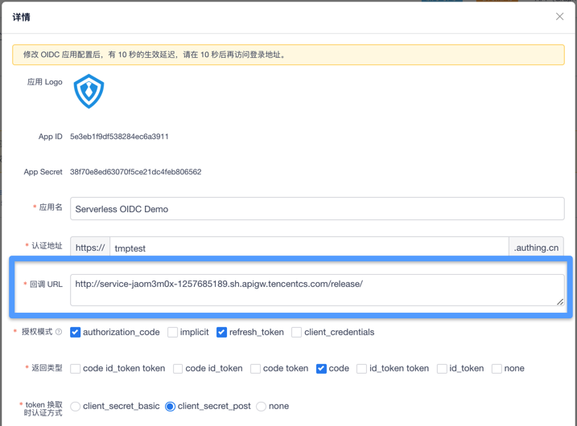

# Serverless-OIDC


Serverless Authing OIDC(OpenID Connect) Demo.

<p align="center">
  <span>简体中文</span> |
  <a href="./README_en.md">English</a>
</p>

## 什么是 OIDC 协议

> OpenID Connect 1.0 is a simple identity layer on top of the OAuth 2.0 protocol. It allows Clients to verify the identity of the End-User based on the authentication performed by an Authorization Server, as well as to obtain basic profile information about the End-User in an interoperable and REST-like manner.

**OpenID Connect 简称 OIDC，是 OAuth 2.0 的一个扩展，主要增加了语义化的用户信息字段。**

下图是一个以授权码为例子的 OIDC 授权流程：


更多信息可以查看 [OIDC 流程](https://docs.authing.cn/authing/advanced/oidc/understand-oidc)。

## 应用介绍 🏠

您可以通过以下几步操作快速的创建一个由 Authing 提供的使用标准 OIDC 协议运行的 serverless 应用。

## 示例链接 🔗

[Serless Oidc Demo](http://service-jaom3m0x-1257685189.sh.apigw.tencentcs.com/)

## 前提条件 🧾

在使用之前，请确保具备以下条件：

1.  [Node.js](https://serverlesscloud.cn/doc/providers/tencent/cli-reference/quick-start#node) （8.x 或以上的版本）
2.  Serverless Framework CLI
3.  Authing OIDC AppID && Secret

### 安装 Node.js 和 NPM

- 参考 [Node.js 安装指南](https://nodejs.org/zh-cn/download/) 根据您的系统环境进行安装。
- 安装完毕后，通过 node -v 命令，查看安装好的 Node.js 版本信息：

```shell
$ node -v
vx.x.x
```

- 通过 npm -v 命令，查看安装好的 npm 版本信息：

```shell
$ npm -v
x.x.x
```

### 安装 Serverless Framework CLI

- 在命令行中运行如下命令：

```shell
$ npm install -g serverless
```

- 安装完毕后，通过运行 serverless -v 命令，查看 Serverless Framework CLI 的版本信息。

```shell
$ serverless -v
x.x.x
```

### 注册 Authing 账户

1. 首先访问[Authing SSO](https://sign.authing.cn/login)进行注册，在注册成功后会自动跳转至 Guide 页面指引你创建一个用户池。
   
2. 在这里填写想要的用户池名。

   

3. 选择二级域名 你可以选择一个你喜欢的二级域名作为你的业务域名。

   

4. 填写回调地址 在这里可以选择你喜欢的业务回调地址。
   

5. 选择 OIDC 应用  
   在创建完成后自动跳转至，控制台。  
   在控制台中分别点击 `第三方登录`->`OIDC应用`后，可以看到已经生成的 OIDC 应用名，点击应用名即可看到该应用信息。

   

6. 在应用信息中可以看到 `AppID` 和 `Secret` 信息

   

## 构建应用 🚗

### 1. 创建需要的文件

本地分别创建 `serverless.yml` `app.js` `index.html` 文件：

```shell
$ touch serverless.yml app.js index.html
```

### 2. 安装所需依赖

```
npm install --save express  @authing/serverless-oidc
```

### 3. 编辑 `serverless.yml` 文件

在 serverless.yml 中进行如下配置

```yml
# serverless.yml
express:
  component: "@serverless/tencent-express"
  inputs:
    region: ap-shanghai
```

### 4. 创建 Express 后端进程

在`app.js`中进行编辑，首先引入 `@authing/serverless-oidc` 以及 `express`。

```js
const express = require("express");
const serverlessOIDC = require("@authing/serverless-oidc");
```

初始化各项参数：

```js
const app = express();
const client_id = "你的 Oidc App id";
const secert = "你的 Oidc secret";
const path = require("path");
const serverless = new serverlessOIDC();
app.use(express.json());
```

为了方便用户进行登录，我们首先创建 `Login` 接口即 `/login` 路由。
对于 `login` 的功能，得益于 `Authing` 的组件和 `OIDC` 协议，我们要做的很简单，只需要把各种参数交给 Authing 的`default`，函数生成 `OIDC` 的登录 `URL`，然后让浏览器跳转到这个 `URL` 即可。
代码如下：

```js
app.get("/login", async (req, res) => {
  let host = req.headers.host;
  redirect_uri = `http://${host}/`;
  const oidcUrl = await new serverlessOIDC().default({
    client_id: client_id,
    redirect_uri: redirect_uri,
    domain: "tmptest.authing.cn",
    scope: "unionid email phone offline_access openid",
    response_type: "code",
    state: "xx1x",
    nonce: "xxxx",
    prompt: "login"
  });
  res.redirect(302, oidcUrl);
});
```

在用户完成认证以后 根据 `OIDC` 的流程设计 我们需要对 `Authing` 返回的 `Code` 进行处理 同时我们也需要展示前端页面，为了完成这两个目的，我们创建`根路由`即`/`。

根路由需要实现的目的有如下两个：

- 使用返回的 Code 来从 Authing 的后台获取 Token 从而完成简单的认证过程。
- 返回展示前端页面

为了实现以上需求，我们需要对于用户请求的 `Query` 进行判断 如果返回的有 `Code` 我们就用这个 `Code` 以及 `OIDC` 的 secret 来从 `Authing` 处获取 `Token`。  
为了更好的表现出 `OIDC` 的流程 我们将 `Token` 设置在用户的 `Cooike` 中来保证后端应用的简单性和无状态性。

```js
app.get("/", async (req, res) => {
  redirect_uri = `http://${req.headers.host}/`;
  let query = req.query;
  if (query && query["code"]) {
    await serverless.default({
      client_id: client_id,
      redirect_uri: redirect_uri,
      domain: "tmptest.authing.cn",
      scope: "unionid email phone offline_access openid",
      response_type: "code",
      state: "xx1x",
      nonce: "xxxx",
      prompt: "login"
    });
    try {
      let token = await serverless.getTokenByCode({
        code: query["code"],
        client_secret: secert,
        grant_type: "authorization_code",
        redirect_uri: redirect_uri
      });

      res
        .cookie("access_token", "Bearer " + token.access_token, {
          expires: new Date(Date.now() + 60 * 3600000) // cookie will be removed after 8 hours
        })
        .redirect(302, "/");
    } catch (err) {
      console.log(err);
      res.send(400, "换取Token失败");
    }
  }
  res.sendFile(path.join(__dirname + "/index.html"));
  return;
});
```

在拿到`Token`以后 我们同样需要获取用户的信息，在 `OIDC` 的流程中有`userinfo`功能，`Authing`已经实现了 `userinfo` 的接口。所以我们也需要实现`/userinfo`路由。  
在这个路由中 我们需要实现用用户的 `Token`来从`Authing`的后端处获取 `Userinfo` 。在 `@authing/serverless-oidc` 中已经有了了方便调用的接口，我们直接使用这个接口即可。  
代码如下：

```js
app.post("/userinfo", async (req, res) => {
  if (!(req.body && req.body.token)) {
    res.send(403, "Unauthorized");
    return;
  }
  let token = req.body.token;
  let user_info = "";
  try {
    user_info = await serverless.getUserInfoByAccessToken(
      token.split("%20")[1]
    );
  } catch (err) {
    console.log(err);
    user_info = "查询失败 请退出重试";
  }
  res.send(200, user_info);
});
```

到目前为止，我们已经实现了一个简单的使用`OIDC`的`serverless`应用的后端部分。

### 5. 创建前端页面

> 一切美好的事物都是曲折地接近自己的目标

我们的应用不能让用户自己去调用接口来使用，所以我们仍需要构建这个应用的前端部分。
在`index.html`中编辑我们的前端页面。  
在最一开始，我们需要一些 `html` 代码来帮助我们构建一个简单的页面。

```html
<head>
  <meta charset="UTF-8" />
  <meta name="viewport" content="width=device-width, initial-scale=1.0" />
  <meta http-equiv="X-UA-Compatible" content="ie=edge" />
  <link rel="shortcut icon" href=https://fe-static.authing.cn/dist/favicon.png
  type=image/png>
  <title>Serverless Oidc Demo</title>
  <style>
    body {
      font-family: Avenir, Helvetica, Arial, sans-serif;
      -webkit-font-smoothing: antialiased;
      -moz-osx-font-smoothing: grayscale;
      text-align: center;
      color: #2c3e50;
      margin-top: 60px;
    }

    a {
      color: #42b983;
      cursor: pointer;
      text-decoration: underline;
    }

    ul {
      list-style-type: none;
    }
  </style>
  <link
    rel="stylesheet"
    href="https://cdn.bootcss.com/jstree/3.3.8/themes/default/style.min.css"
  />
</head>

<body>
  <div style="margin-bottom:22px">
    
    <h1>Authing Srverless Oidc ServerDemo</h1>
    <h2>当前状态：<span id="status">检测中</span></h2>
    <h3 id="authingUserIdContainer">
      我的用户信息：
      <div id="authingUserId" style=" overflow-wrap: break-word;"></div>
    </h3>
  </div>
  <a id="btn-login" href="./login">使用 Authing 登录</a>
  <br />
  <a id="btn-logout" href="#">退出</a>
  <br />
  <p>使用 Authing</p>
  <a href="https://authing.cn/" target="_blank">Authing 官网</a>
  <a href="https://docs.authing.cn/" target="_blank">Authing 官方文档</a>
  <br />
  <p>Authing & Serverless</p>
  <a
    href="https://github.com/Authing/serverless-oidc/tree/master/demo"
    target="_blank"
    style="margin-left:11px"
    >本 Demo示例代码</a
  >
</body>
```

> 生命在于运动

只有页面是不够的，我们需要页面可以动态地展示登录状态以及用户数据。  
因此，我们需要使用 `js` 实现以下接口：

- 获取登录情况和登录信息
  因为我们将 `Token` 保存在了用户的 `Cookie` 中 因此 我们只需要查看用户的 `Cookie` 信息中是否保存的有 `Token` 信息即可。在用户已经登录的同时我们同样需要获取用户信息，因此我们还需要实现获取用户信息的功能。
  代码如下：

```js
async function getUserInfo() {
  let token = getCookie("access_token");
  infoCard.innerHTML = "加载中";
  let res = await axios.post("./userinfo", { token: token });
  infoCard.innerText = JSON.stringify(res.data);
}
function checkLogined() {
  let token = getCookie("access_token");
  if (!token) {
    document.getElementById("status").innerHTML = "未登录";
    logout.setAttribute("style", "display:none");
  } else {
    getUserInfo();
    document.getElementById("status").innerHTML = "已登录";
  }
}
```

> 生命之所以有意义是因为它会停止。

- 实现登出功能

我们还需要实现退出登录功能,由于我们的登录信息都是保存在 `Token` 中的 我们只需要清空 `Cookie` 即可，但我们也需要知道用户已经登出。所以，我们可以通过 `Authing` 的 `SSO-SDK` 来简洁的实现这一目的。

代码如下：

```html
<script src="https://cdn.jsdelivr.net/npm/@authing/sso/dist/AuthingSSO.umd.min.js"></script>
<script>
  async function cleanToken() {
    let auth = new AuthingSSO({
      appId: "5e3eb1f9df538284ec6a3911",
      appDomain: "tmptest.authing.cn"
    });
    await auth.logout();
    let cookies = document.cookie.split(";");
    for (var i = 0; i < cookies.length; i++) {
      let cookie = cookies[i];
      let eqPos = cookie.indexOf("=");
      let name = eqPos > -1 ? cookie.substr(0, eqPos) : cookie;
      document.cookie = name + "=;expires=Thu, 01 Jan 1970 00:00:00 GMT";
    }
    location.reload();
  }
</script>
```

最后我们只需要将组件和函数绑定，即可完成整个项目所有的部分。
代码如下：

```html
<script>
  window.onload = main;
  async function main() {
    const login = document.getElementById("btn-login");
    const logout = document.getElementById("btn-logout");
    const infoCard = document.getElementById("authingUserId");
    logout.onclick = cleanToken;
    async function getUserInfo() {
      let token = getCookie("access_token");
      infoCard.innerHTML = "加载中";
      let res = await axios.post("./userinfo", { token: token });
      infoCard.innerText = JSON.stringify(res.data);
    }
    function checkLogined() {
      let token = getCookie("access_token");
      if (!token) {
        document.getElementById("status").innerHTML = "未登录";
        logout.setAttribute("style", "display:none");
      } else {
        getUserInfo();
        document.getElementById("status").innerHTML = "已登录";
      }
    }
    checkLogined();
  }
</script>
```

## 部署 🛫️

使用 `serverless` 部署应用是十分简单的。
只需要通过`sls`命令即可完成部署，并可以添加`--debug`参数查看部署过程中的信息。
如您的账号未登陆或注册腾讯云，您可以直接通过微信扫描命令行中的二维码进行授权登陆和注册。

```shell
$ sls --debug
```

### 移除

通过以下命令移除部署的存储

```
sls remove --debug
```

### 账号配置（可选）

当前默认支持 CLI 扫描二维码登录，如你希望配置持久的环境变量/秘钥信息，也可以本地创建 `.env` 文件
在 .env 文件中配置腾讯云的 SecretId 和 SecretKey 信息并保存

```
# .env
TENCENT_SECRET_ID=123
TENCENT_SECRET_KEY=123
```

## 配置回调地址

部署完成后 `cli` 界面会返回项目的 `url` 地址。

```sh
$ sls --debug

  DEBUG ─ Resolving the template's static variables.
  DEBUG ─ Collecting components from the template.
  DEBUG ─ Downloading any NPM components found in the template.
  DEBUG ─ Analyzing the template's components dependencies.
  DEBUG ─ Creating the template's components graph.
  DEBUG ─ Syncing template state.
  DEBUG ─ Executing the template's components graph.
  DEBUG ─ Removing function
  DEBUG ─ Request id
  DEBUG ─ Compressing function ExpressComponent_b7ilv1 file to /Users/holegots/Project/Authing/serverless_compontents/serverless-oidc/demo/.serverless/ExpressComponent_b7ilv1.zip.
  DEBUG ─ Compressed function ExpressComponent_b7ilv1 file successful
  DEBUG ─ Uploading service package to cos[sls-cloudfunction-ap-shanghai-code]. sls-cloudfunction-default-ExpressComponent_b7ilv1-1582188831.zip
  DEBUG ─ Uploaded package successful /Users/holegots/Project/Authing/serverless_compontents/serverless-oidc/demo/.serverless/ExpressComponent_b7ilv1.zip
  DEBUG ─ Creating function ExpressComponent_b7ilv1
  DEBUG ─ Created function ExpressComponent_b7ilv1 successful
  DEBUG ─ Setting tags for function ExpressComponent_b7ilv1
  DEBUG ─ Creating trigger for function ExpressComponent_b7ilv1
  DEBUG ─ Deployed function ExpressComponent_b7ilv1 successful
  DEBUG ─ Starting API-Gateway deployment with name express.TencentApiGateway in the ap-shanghai region
  DEBUG ─ Using last time deploy service id service-jaom3m0x
  DEBUG ─ Updating service with serviceId service-jaom3m0x.
  DEBUG ─ Endpoint ANY / already exists with id api-g8bwotc8.
  DEBUG ─ Updating api with api id api-g8bwotc8.
  DEBUG ─ Service with id api-g8bwotc8 updated.
  DEBUG ─ Deploying service with id service-jaom3m0x.
  DEBUG ─ Deployment successful for the api named express.TencentApiGateway in the ap-shanghai region.

  express:
    region:              ap-shanghai
    functionName:        ExpressComponent_b7ilv1
    apiGatewayServiceId: service-jaom3m0x
    url:                 http://service-jaom3m0x-1257685189.sh.apigw.tencentcs.com/release/

  38s › express › done
```

由于安全性你需要在`Authing`的`OIDC`详情中配置回调 URL 来允许我们创建的 `serverless 应用`使用 `OIDC` 登录服务。  
在前面的准备阶段我们已经提过如何访问找到`OIDC`的详情页面。如果没有找到，还请返回查看。
在详情页面中 我们只需要在`回调 URL` 的部分中将我们的`app url` 填写进去即可。


## Have fun!🎉
