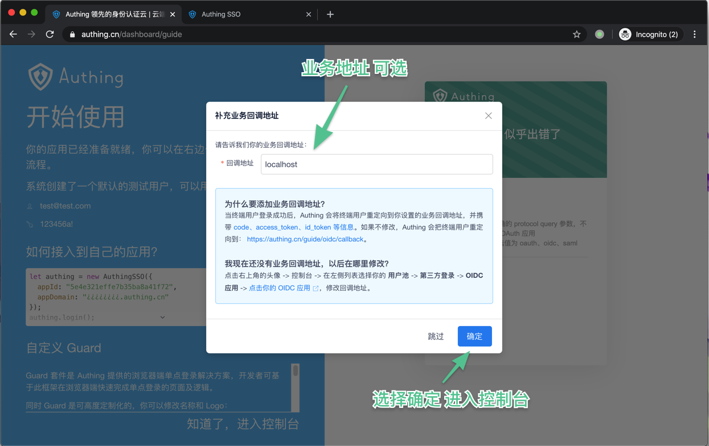

# Serverless-oidc


Serverless Authing OIDC(OpenID Connect) Demo.

<p align="center">
  <span>简体中文</span> |
  <a href="./README_en.md">English</a>
</p>
## 应用介绍 🏠

您可以通过以下几步操作快速的创造一个由 Authing 提供的使用标准 OIDC 协议运行的 serverless 应用。

## 示例链接 🔗

[Serless Oidc Demo](http://service-jaom3m0x-1257685189.sh.apigw.tencentcs.com/)

## 前提条件 🧾

在使用之前，请确保具备以下条件：

1.  [Node.js](https://serverlesscloud.cn/doc/providers/tencent/cli-reference/quick-start#node) （8.x 或以上的版本）
2.  Serverless Framework CLI
3.  Authing Oidc AppID && serert

### 安装 Node.js 和 NPM

- 参考 [Node.js 安装指南](https://nodejs.org/zh-cn/download/) 根据您的系统环境进行安装。
- 安装完毕后，通过 node -v 命令，查看安装好的 Node.js 版本信息：

```shell
$ node -v
vx.x.x
```

- 通过 npm -v 命令，查看安装好的 npm 版本信息：

```shell
$ npm -v
x.x.x
```

### 安装 Serverless Framework CLI

- 在命令行中运行如下命令：

```shell
$ npm install -g serverless
```

- 安装完毕后，通过运行 serverless -v 命令，查看 Serverless Framework CLI 的版本信息。

```shell
$ serverless -v
x.x.x
```

### 注册 Authing 账户

1. 首先访问[Authing SSO](https://sign.authing.cn/login) 可进行注册一个账号
   创建成功后即可会自动跳转至 Guide 页面指引你创建一个用户池
   
2. 在这里填写想要的用户池名
   
3. 选择二级域名 你可以选择一个你喜欢的二级域名作为你的业务域名
   
4. 填写回调地址 在这里可以选择您的业务回调地址
   
5. 选择 OIDC 应用
   创建完成后即可进入 控制台
   在控制台中分别点击 `第三方登录` `OIDC` 应用后可以 可以看到已经生成的 OIDC 应用名 点击应用名即可看到应用信息
   

在应用信息中可以看到 AppID 和 Secert 信息


## 创建应用 🚗

clone 本仓库

```
git clone
```

## 安装依赖 🕙

```
npm install
```

## Deploy 🛫️

```shell
$ sls --debug
```

Have fun !
